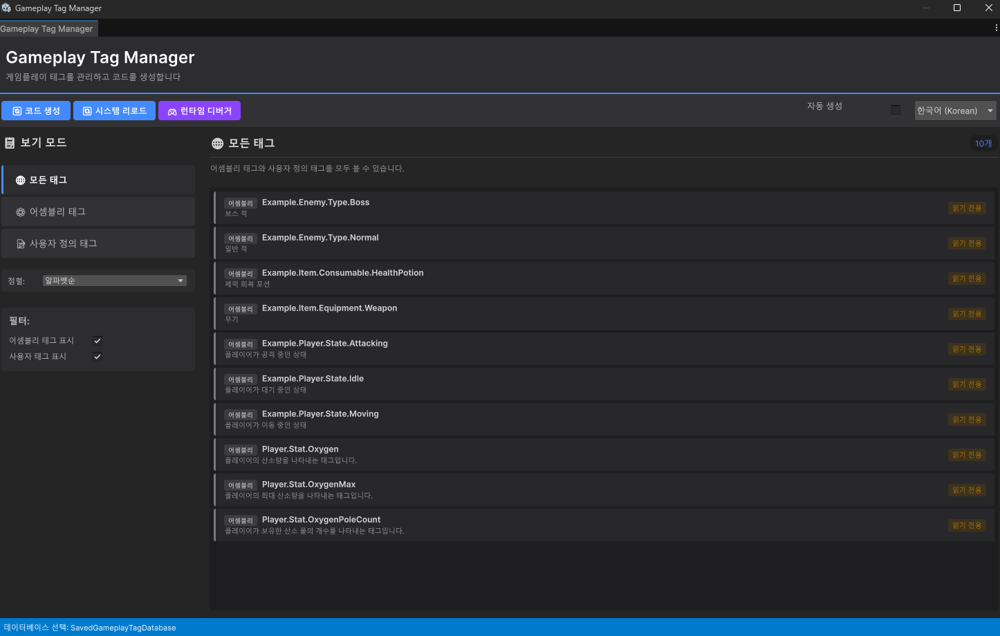
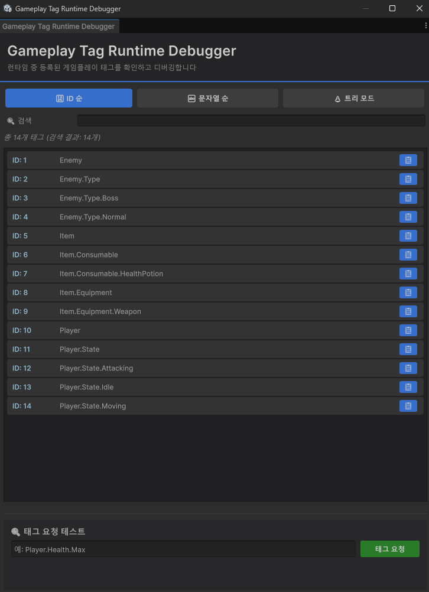

# Gameplay Tags for Unity

---

## Overview

This package brings **Unreal Engine's Gameplay Tag system** to Unity.

Gameplay Tags are **hierarchical string-based identifiers** that provide a flexible and efficient way to represent gameplay-related states, properties, and conditions.

### Key Features

* **Hierarchical String-Based ID System** - Organize tags like `"Damage.Fire.DoT"`
* **Fast Comparison Performance** - `==` comparison is O(1), hierarchy checks are O(level)
* **ScriptableObject-Based Architecture** - Compatible with most platforms
* **Network Support** - Network serialization for Unity Netcode for GameObjects (NGO)
  * Dynamically created tags during gameplay may not sync
  * Requires identical game versions across clients
* **Editor Integration** - Intuitive editor UI provided
* **Runtime Debugging** - Runtime UI to inspect registered tags

### Use Cases

* Marking abilities, states, effects, or interactions
* Checking conditions without hard-coded references
* Creating clean and scalable gameplay logic

---

## Getting Started

Before you can use tags, you first need to **create them**. There are three main ways to register tags in your project:

### 1. Creating Tags via ScriptableObject

Create a Tag Database through Unity's menu: `Assets/Create/Gameplay Tags/Tag Database`.

Once created, you can open the database asset to add, modify, and delete tags through the inspector interface.


### 2. Creating Tags via Editor UI


Click the **Gameplay Tags** button in Unity's top menu bar to open the tag editor window.

This window allows you to directly create and manage tags, as well as view all tags registered at runtime.

### 3. Registering Tags with Assembly Attributes

You can also declare tags directly in code:

```csharp
[assembly: GameplayTagDef("Damage.Fatal")]
[assembly: GameplayTagDef("Damage.Fire")]
[assembly: GameplayTagDef("Damage.Fire.DoT")]
[assembly: GameplayTagDef("CrowdControl.Stunned")]
```

This approach is particularly useful when **your code requires the existence of certain tags**. It ensures the tag is always registered alongside the code that depends on it.

---

## API Reference

### `GameplayTag`

A lightweight struct representing a gameplay tag.

#### Core Properties

* **`string TagName`** - The full name of the tag (e.g., `"Damage.Fire"`)
* **`bool IsValid`** - Whether the tag is valid (registered in the system)
* **`bool IsNone`** - Whether the tag is the special `None` tag
* **`GameplayTag None`** - A special value representing an empty or invalid tag

#### Hierarchy Methods

* **`bool IsParentOf(GameplayTag other)`** - Check if this tag is a parent of another tag
  * Example: `"Damage"` is a parent of `"Damage.Fire"`
* **`bool IsChildOf(GameplayTag other)`** - Check if this tag is a child of another tag
  * Example: `"Damage.Fire.DoT"` is a child of `"Damage.Fire"`

#### Performance Characteristics

* **Tag Comparison (`==`)** - O(1) - Immediate comparison using internal IDs
* **Hierarchy Check** - O(level) - Proportional to hierarchy depth for parent-child relationships

---

### `GameplayTagManager`

A static class responsible for managing all registered tags.

* **`RequestTag(string name)`** - Get a `GameplayTag` by name (returns `GameplayTag.None` if not found)
* **`TryRequestTag(string name, out GameplayTag tag)`** - Attempt to request a tag (returns success/failure)
* **`GetAllTags()`** - Returns all registered tags
* **`HasBeenReloaded`** *(property)* - Indicates whether tags have been reloaded at runtime

---

### `GameplayTagContainer`

The main API for working with sets of tags. Provides methods to add, remove, query, and combine gameplay tags.

#### Managing Tags

* **`AddTag(GameplayTag tag)`** - Add a tag to the container (increments count)
* **`AddTagUnique(GameplayTag tag)`** - Add a tag only if it doesn't exist (only when count is 0)
* **`RemoveTagOnce(GameplayTag tag)`** - Remove a tag once (decrements count)
* **`RemoveTagAll(GameplayTag tag)`** - Remove all instances of a tag (sets count to 0)
* **`ClearTags()`** - Clear all tags

#### Querying Tags

* **`HasTag(GameplayTag tag)`** - Check if the container contains the given tag (count > 0)
* **`CountTag(GameplayTag tag)`** - Returns the count of the tag
* **`HasTagIncludeChildren(GameplayTag tag)`** - Check if tag exists including child tags
* **`CountTagIncludeChildren(GameplayTag tag)`** - Returns count including child tags
* **`HasAnyTags(IGameplayTagContainer other)`** - Returns true if any tags from another container are present
* **`HasAllTags(IGameplayTagContainer other)`** - Returns true if all tags from another container are present

#### Properties

* **`int UniqueTagCount`** - Number of unique tags (tags with count > 0)
* **`int TotalTagCount`** - Total tag count (sum of all counts)

---

### Network Support (Netcode for GameObjects)

The `GameplayTag` system provides specialized types and containers designed for efficient synchronization within Unity Netcode for GameObjects (NGO).

#### **Supported Types**

* **`GameplayTagReference` (struct)**: A lightweight wrapper that serializes a `GameplayTag` as a 4-byte integer ID. Implements `INetworkSerializable`, making it ideal for RPC parameters or as a member of other networked structures.
* **`NetworkGameplayTagContainer` (class)**: A custom network variable inheriting from `NetworkVariableBase`.
* **Delta Replication**: Instead of sending the entire container, it transmits only the **incremental changes** (Add, Remove, or Value updates), significantly optimizing network bandwidth.
* **Counter-Based System**: Supports stacking multiple instances of the same tag, syncing the exact count of each tag across the network.
* **Event-Driven**: Provides granular callbacks like `OnTagCountChanged` for reactive gameplay logic on clients.


#### **Important Notes**

* **Database Consistency**: All clients must use an identical tag database with matching IDs to ensure correct synchronization.
* **Authority Model**: Follows standard `NetworkVariable` permissions. It is highly recommended to modify tags on the server and use the container for read-only synchronization on clients.

---

## Usage Examples

### Basic Tag Usage

```csharp
using Machamy.GameplayTags.Runtime;

// Request tags
GameplayTag fireTag = GameplayTagManager.RequestTag("Damage.Fire");
GameplayTag dotTag = GameplayTagManager.RequestTag("Damage.Fire.DoT");

// Hierarchy check
if (dotTag.IsChildOf(fireTag))
{
    Debug.Log("DoT is a subtype of Fire damage.");
}

// Tag comparison (O(1))
if (fireTag == dotTag)
{
    // Not equal
}
```

### Using Containers

```csharp
using Machamy.GameplayTags.Runtime;

public class CharacterStatus : MonoBehaviour
{
    [SerializeField]
    private GameplayTagContainer statusTags = new GameplayTagContainer();
    
    public void ApplyBurn()
    {
        GameplayTag burnTag = GameplayTagManager.RequestTag("Status.Burn");
        statusTags.AddTag(burnTag);
    }
    
    public bool IsBurning()
    {
        GameplayTag burnTag = GameplayTagManager.RequestTag("Status.Burn");
        return statusTags.HasTag(burnTag);
    }
    
    public void RemoveBurn()
    {
        GameplayTag burnTag = GameplayTagManager.RequestTag("Status.Burn");
        statusTags.RemoveTagAll(burnTag);
    }
}
```

### Leveraging Hierarchy

```csharp
// Check if container has "Damage" tag or any of its children
GameplayTag damageTag = GameplayTagManager.RequestTag("Damage");

if (container.HasTagIncludeChildren(damageTag))
{
    // Matches "Damage", "Damage.Fire", "Damage.Ice", etc.
    Debug.Log("Taking damage of some kind!");
}
```

---

## Credits

This project is a **re-implementation** and adaptation based on the concepts and structure of [BandoWare/GameplayTags](https://github.com/BandoWare/GameplayTags).

While the codebase has been completely rewritten, the underlying design is adapted from the original work. The implementation has been redesigned to use **Roslyn Source Generators** instead of the original runtime approach.

### Original Project Details
* **Original Project:** [GameplayTags](https://github.com/BandoWare/GameplayTags)
* **Original Author:** BandoWare
* **Original License:** [CC BY 4.0](https://creativecommons.org/licenses/by/4.0/)
* **Modifications:** The code has been completely rewritten to utilize Roslyn Source Generators instead of the original runtime implementation.

---

## License

### MIT License

**Copyright (c) 2026 Machamy**

Permission is hereby granted, free of charge, to any person obtaining a copy
of this software and associated documentation files (the "Software"), to deal
in the Software without restriction, including without limitation the rights
to use, copy, modify, merge, publish, distribute, sublicense, and/or sell
copies of the Software, and to permit persons to whom the Software is
furnished to do so, subject to the following conditions:

The above copyright notice and this permission notice shall be included in all
copies or substantial portions of the Software.

THE SOFTWARE IS PROVIDED "AS IS", WITHOUT WARRANTY OF ANY KIND, EXPRESS OR
IMPLIED, INCLUDING BUT NOT LIMITED TO THE WARRANTIES OF MERCHANTABILITY,
FITNESS FOR A PARTICULAR PURPOSE AND NONINFRINGEMENT. IN NO EVENT SHALL THE
AUTHORS OR COPYRIGHT HOLDERS BE LIABLE FOR ANY CLAIM, DAMAGES OR OTHER
LIABILITY, WHETHER IN AN ACTION OF CONTRACT, TORT OR OTHERWISE, ARISING FROM,
OUT OF OR IN CONNECTION WITH THE SOFTWARE OR THE USE OR OTHER DEALINGS IN THE
SOFTWARE.

See the [LICENSE](License.md) file for details.

### Attribution Notice (Original Work)

This project is a **re-implementation** and adaptation based on the concepts and structure of **GameplayTags** by **BandoWare**.

While the codebase has been rewritten, the underlying design is adapted from the original work licensed under the **Creative Commons Attribution 4.0 International License (CC BY 4.0)**.

To view a copy of the CC BY 4.0 license, visit http://creativecommons.org/licenses/by/4.0/

